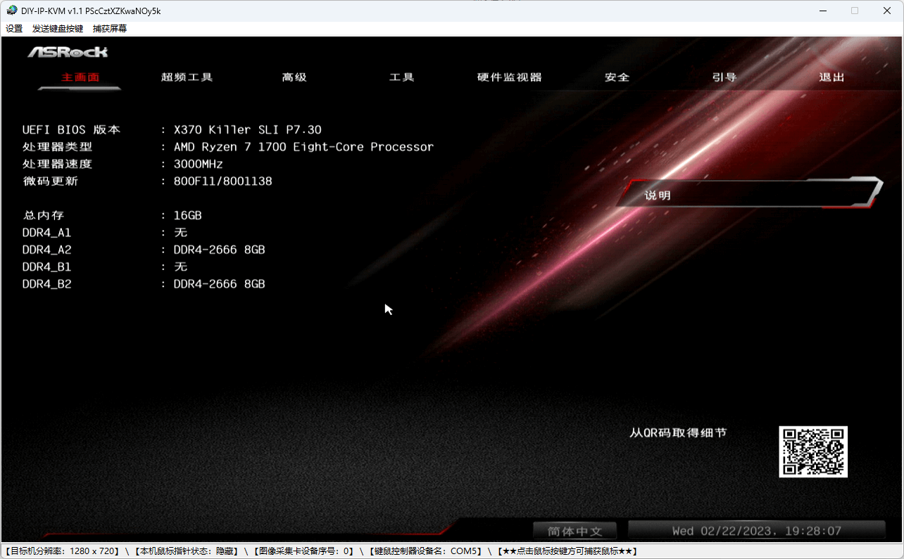
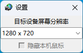
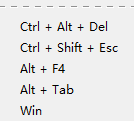
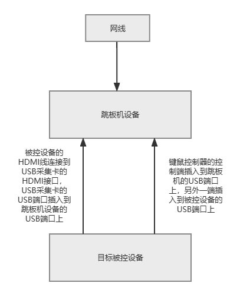
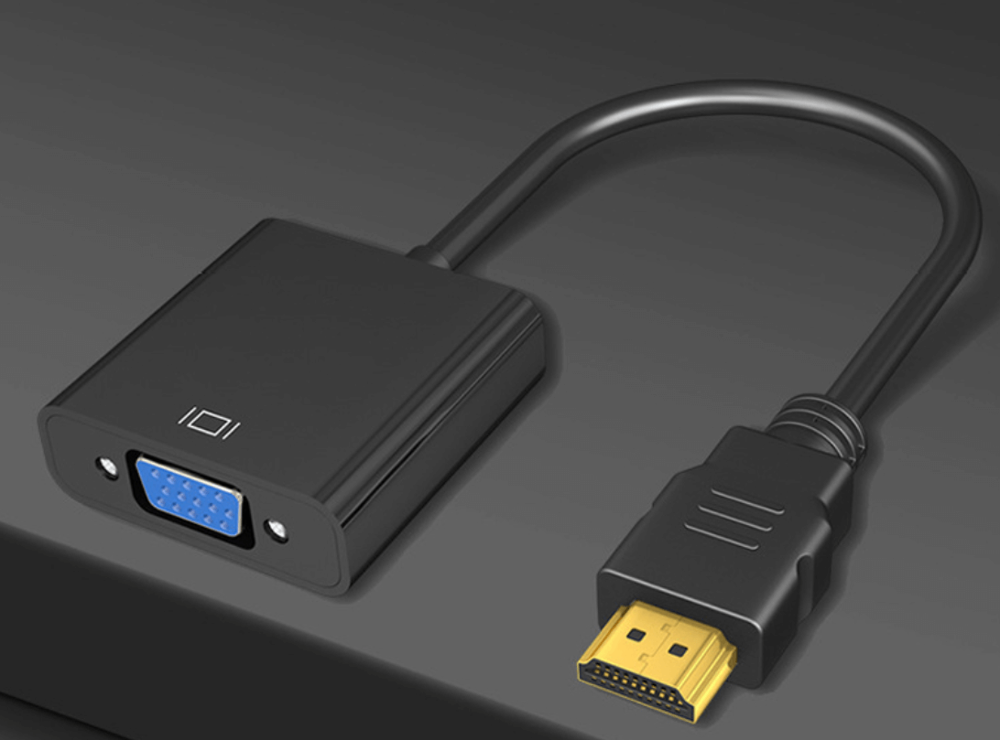
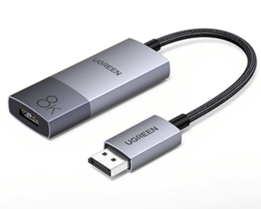
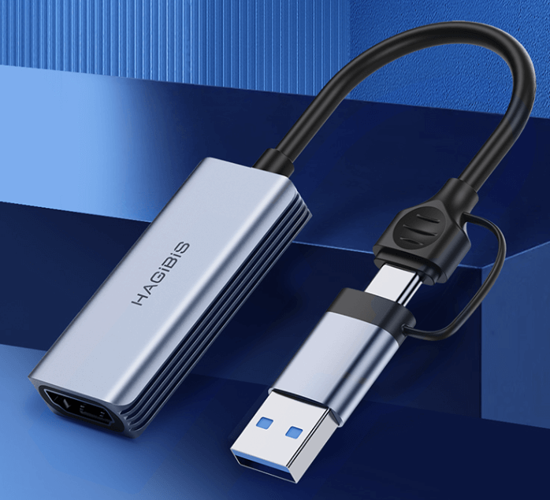
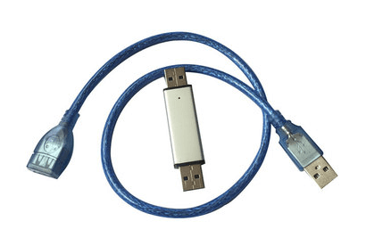

# DIY-IP-KVM软件使用说明

## 1.设计思想
&emsp;主要凸显“DIY”，所有符合要求的硬件都可以自主挑选，这就好比购买电脑配件然后自己组装电脑一样。DIY-IP-KVM项目以最小的资金支出、软硬件东拼西凑及自己动手丰衣足食做为设计理念，花费最少资金即可实现畅所欲为的IP-KVM体验！ 

## 2.什么是IP-KVM
&emsp;普通远程软件无法实现系统未启动阶段的管理控制，例如BIOS配置管理、磁盘RAID卡配置管理、重装系统等阶段的控制操作。所以，此时IP-KVM的控制方式就有了用武之地，它主要可以解决普通远程软件无法操作阶段的管理控制。对于服务器系统运维人员来说，当需要对这些阶段进行操作的时候，不用亲临现场就可以进行管理操作了。 

## 3.部署介绍
&emsp;本软件推荐部署到低功耗设备上（以下会称之为“跳板机”），如树莓派、Intel NUC或者其它ARM板，当然，强悍的x86主机也是可以的。操控目标机可以通过RDP远程桌面方式登录到部署了本软件的电脑设备上来操控目标主机，同时也可以将“跳板机”的USB端口映射到本机并运行本软件进行操作目标主机，如果是ARM体系的跳板机，推荐采用USB端口映射的方式进行操作，这里推荐使用VirtualHere软件，它对各种体系的CPU平台支持的非常多，操作也非常简单。 

## 4.软件界面

软件截图（BIOS环境界面）

 
&emsp;界面非常简单，主要包括“菜单栏”、“目标设备屏幕图像显示区域”及“状态栏”。 

### 4.1.菜单栏区域
&emsp;菜单栏中提供了“设置”、“发送键盘按键”及“捕获屏幕”等功能，下面对其进行详细介绍： 
&emsp;**设置**：提供对“目标设备屏幕分辨率”的设置及“隐藏本机鼠标”的功能。 

&emsp;**发送键盘按键**：提供对常见键盘组合键的发出指令操作功能，例如，Ctrl+Alt+Del、Ctrl+Shift+Esc等。 

&emsp;**捕获屏幕**：提供对“目标设备屏幕图像”进行截屏操作，默认保存在本软件目录下的“Screenshot”目录中，以png格式保存。 

### 4.2.目标设备屏幕图像显示区域
&emsp;本区域可显示目标设备屏幕图像内容，同时也是采用“相对定位的鼠标控制方式”的鼠标捕获区域，本区域大小可以使用“设置”中提供的设置“目标设备屏幕分辨率”进行修改。 

### 4.3.状态栏区域
&emsp;提供一系列信息显示，例如“目标设备屏幕分辨率”、“本机鼠标指针状态”、“图像采集卡设备序号”、“键鼠控制器设备名”及采用“相对定位的鼠标控制方式”的鼠标捕获与释放的提示等信息。 
&emsp;当鼠标进入“捕获状态”后想要释放鼠标，请按键盘Ctrl+Alt+Space组合键。 

#### 4.3.1.目标设备屏幕分辨率
&emsp;显示目标设备的屏幕分辨率信息，例如1024x768，1920x1080等。 
#### 4.3.2.本机鼠标指针状态
&emsp;显示本机鼠标指针状，例如“显示”、“隐藏”，对于鼠标选择使用“相对定位”控制方式，默认本机鼠标的针状默认为“隐藏”状态，只有鼠标使用“绝对定位”控制方式才会有显示上的变化。 
#### 4.3.3.图像采集卡设备序号
&emsp;图像采集卡设备序号，如果“跳板机”上只有一个采集卡默认情况为0，如果还有其他设备，例如USB摄像头，那就视情况而定了。 
#### 4.3.4.键鼠控制器设备名
&emsp;键鼠控制器设备名，与“跳板机”的操作系统有关，例如在Windows中一般为“COM*”，Linux中一般为“/dev/ttyUSB*”。 
#### 4.3.5.鼠标捕获与释放提示信息
&emsp;只有当鼠标选择使用“相对定位”控制方式，才能看到此信息，会提示如何捕获与释放鼠标的提示信息。 

## 5.配置文件
&emsp;配置文件中存有所有软件相关配置信息，首次使用请自行配置，格式如下： 

### 5.1.硬件设置
*[Hardware] 
videodeviceindex = 0 # USB图像采集卡设备序号 
videodevicefps = 60 # FPS帧率 
videodeviceimageoutputformat = 1 # 图像输出格式 1：YUY2 2：MJPG 
hidserialdevicename = COM3 # 键盘与鼠标控制器设备名  例：Linux:/dev/ttyUSB* | Windows:COM** 

### 5.2.软件参数设置
*[Parameter] 
displayresolution_width = 1280 # 目标设备屏幕分辨率（宽） 
displayresolution_height = 720 # 目标设备屏幕分辨率（高） 
hidelocalmouse = 0 # 是否隐藏本机鼠标指针 0：不隐藏 1：隐藏 
mouseoffsetx = 0 # 鼠标消除偏差（x） 
mouseoffsety = 0 # 鼠标消除偏差（y） 
mousepositionmethod = 2 # 鼠标定位方法 1：绝对定位 2：相对定位（推荐）* 

## 6.硬件连接

物理连接结构图

## 7.硬件选配
&emsp;因本项目凸显“DIY”设计理念，所以辅助的硬件搭配方面一定要符合本软件所支持的硬件设备，但品牌可自行选择。 
### 7.1.USB采集卡
&emsp;采用MS2109及MS2130芯片方案，这里更加推荐选择MS2130芯片方案的USB采集卡，因为它的图像延时方面更低，但价格相对于MS2109芯片方案的USB采集卡会贵一些。 
&emsp;其他芯片方案的采集卡目前没有测试过，各位可以自行测试。 
#### 7.1.1.额外可能会用到的视频转换器
&emsp;因目前大多数USB采集卡的采集端口多数为HDMI端口，若目标设备没有HDMI端口，只有VGA或DP端口，那么可以单独购买相应的转换器，然后将转换器的HDMI端口与USB采集卡的HDMI端口相连接。 

HDMI转VGA端口转换器

DP转HDMI端口转换器

MS2130芯片方案的USB采集卡

### 7.2.键盘鼠标控制器
&emsp;目前只对“专业控制板定制”淘宝店铺内的“USB模拟键盘鼠标，USB串口转键盘鼠标”商品加以适配。 
&emsp;商品链接：https://item.taobao.com/item.htm?spm=a1z10.3-c.w4002-1827262589.21.7e81463fPT7HdD&id=572128719163 

键盘与鼠标控制器

## 8.注意事项
&emsp;如果鼠标定位方式使用“模拟绝对定位方式”，如目标主设备系统是Windows系统，需要在目标主设备系统中将鼠标指针选项中的“提高指针精确度”去掉，并将“选择指针移动速度”滑块移动至中间即可，如果不进行此设置会导致鼠标定位不准，Linux及BIOS下也有类似情况，所以这里推荐使用鼠标的“相对定位方式”进行控制，就免去了上述操作。 

## 9.其他
### 9.1.关于VirtualHere软件
&emsp;此软件为收费软件，因对各种CPU体系架构支持良好所以推荐，具体使用方法请参见其官方网站：https://www.virtualhere.com/ 

### 9.2.关于其他厂家 “键盘鼠标控制器”的适配问题
&emsp;因本软件目前只支持一种“键盘鼠标控制器”，若其他厂家的“键盘鼠标控制器”也想加入支持请与作者联系。 
